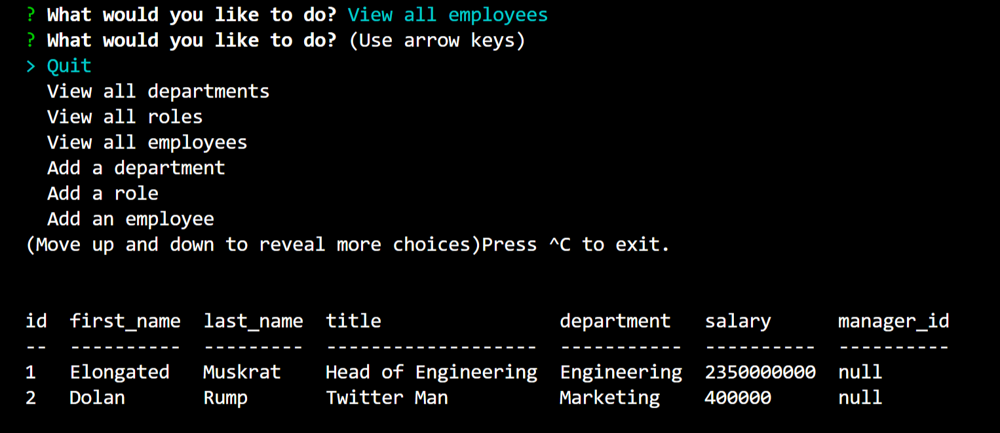
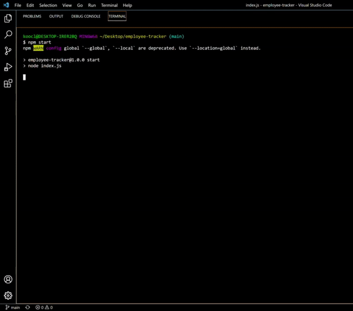

# SQL: Employee Tracker

This is a command-line application used to manage a company's employee database. A walkthrough video has been included to demonstrate its functionality.

## Table of Contents
- [Technologies](#technologies)
- [Code Snippets](#code-snippets)
- [Software Demo](#demo)
- [Credits](#credits)

## Technologies Used
- Javascript
- Node.js
- Inquirer
- mySQL

These CMS interfaces used to access the information stored in the databases were built using Node.js, Inquirer, and MySQL.

## Code Snippets
The following code showcases an attempt to implement a helper function used to faciliate the Inquirer prompting process. While in practice it turned out to be more complicated then initially anticipated, the snippet at least shows there was an effort.
```java
const userPrompts = () => {
    return inquirer.prompt([
        {
            type:'list',
            message:'What would you like to do?',
            name:'query',
            choices: [  'View all departments', 
                        'View all roles',
                        'View all employees',
                        'Add a department', 
                        'Add a role', 
                        'Add an employee', 
                        'Update an employee role',
                        'Quit'],
            default: 'Quit',
        },
    ])
}

module.exports = userPrompts;
```

## Demo

<br>

<br>

<br>

## Credits

UCB - Coding Bootcamp

---

© 2022 Clement Koo. All Rights Reserved.
[LinkdIn](https://www.linkedin.com/in/clement-t-k-459322138/) |
[GitHub](https://github.com/C-K999)
